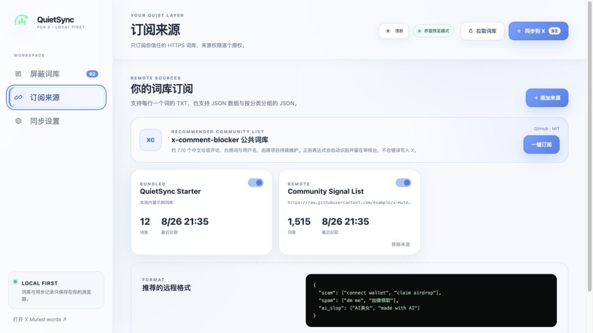
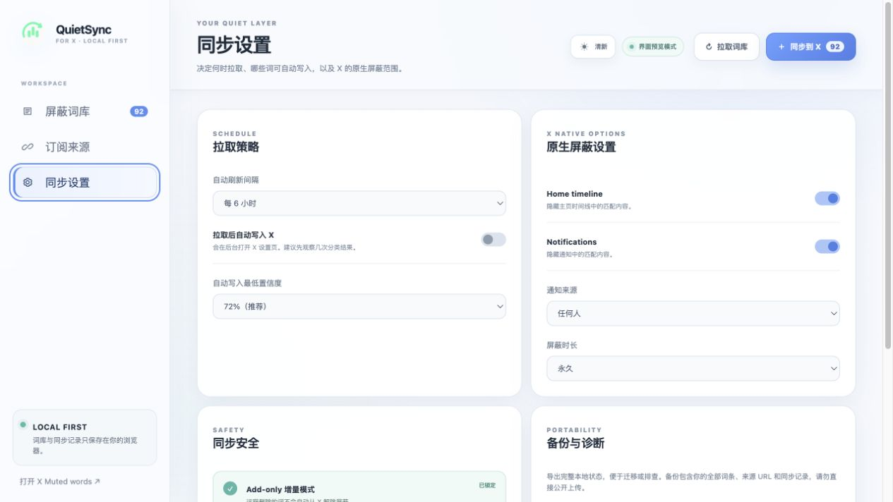

<p align="center">
  
</p>

<h1 align="center">QuietSync for X</h1>

<p align="center">把维护词库这件麻烦事交给浏览器，把安静留给自己。</p>

<p align="center">
  <a href="https://github.com/SteinsHead/quietsync-x/actions/workflows/ci.yml"></a>
  <a href="https://github.com/SteinsHead/quietsync-x/releases"></a>
  <a href="LICENSE"></a>
  
</p>

做这个项目的起点很简单：网上已经有人在认真维护垃圾内容词库，X 也有自己的 **Muted words**，可两者之间始终缺一个可靠的搬运工。

手动加十几个词还行，几百个就变成了苦差事。普通的网页过滤插件虽然方便，但换到手机上，一切又得重来。

QuietSync 做的就是中间这一步：定时取回你订阅的词库，在本地整理好，让你看一遍，然后把新增内容写进 X 自己的屏蔽词。写进去之后，它们跟着 X 账户走，手机、平板和其他电脑都能生效。

它不会替你决定该看什么，也不会偷偷删除你原来的设置。最终按下同步按钮的人，始终是你。

> QuietSync 不是 X 官方产品，也与 X Corp. 没有关系。X 的屏蔽词目前主要影响主页时间线和通知，不会过滤搜索结果。

## 看起来是这样


审核台会告诉你词从哪里来、被分到了哪一类、哪些已经同步，以及哪些最好再看一眼。截图里的内容都是项目自带的演示数据，不是真实账号数据。

默认是清新的浅色界面；右上角可以随时切到夜间模式。外观偏好只保存在浏览器本地，审核台和插件弹窗会保持一致。

<table>
  <tr>
    <td width="50%"></td>
    <td width="50%"></td>
  </tr>
  <tr>
    <td align="center">订阅公开词库，也可以只用自己的地址</td>
    <td align="center">同步频率、自动化门槛和 X 选项都能自己定</td>
  </tr>
</table>

## 它具体会做什么

QuietSync 能读常见的 TXT 和 JSON 词库。不同来源里的重复项会自动合并；奇怪的空格、大小写和用来绕过匹配的不可见字符也会被整理掉。

词条会在浏览器里按诈骗、推广、互动诱导、加密、成人、骚扰、政治、AI 低质等类别归档。这个分类用的是简单透明的本地规则，不是什么神秘模型，所以分错时你可以直接改。

确认同步后，QuietSync 会打开 X 的 Muted words 页面，像人操作网页一样逐条填写和保存。遇到已有词会跳过，页面临时出错会重试，也可以随时停止。远程词库以后删掉某个词，QuietSync **不会**顺手帮你解除屏蔽——维护者改变主意，不代表你也必须改变主意。

自动同步是可选项，而且默认关闭。真要开启，也可以设置最低置信度，避免宽泛或没把握的词直接进入账号。

## 安装

目前还没有上架浏览器商店，安装需要一分钟：

1. 从 [Releases](https://github.com/SteinsHead/quietsync-x/releases) 下载最新的 `quietsync-x-*.zip`。
2. 解压到一个不容易误删的目录。
3. 在 Chrome 打开 `chrome://extensions/`，Edge 则打开 `edge://extensions/`。
4. 开启右上角的「开发者模式」，点击「加载已解压的扩展程序」。
5. 选择刚刚解压、里面直接放着 `manifest.json` 的目录。

如果更喜欢从源码开始：

```bash
git clone https://github.com/SteinsHead/quietsync-x.git
cd quietsync-x
npm test
```

QuietSync 没有运行时依赖，也不需要打包构建，浏览器可以直接加载源码。

## 第一次使用

安装后打开扩展，再进入「审核台」。内置的小词表只是让你看看界面，不会突然往账号里写一大堆东西。

前往「订阅来源」，可以一键加入 `x-comment-blocker` 的公共词库，也可以填写自己的 GitHub Raw 或其他 HTTPS 静态地址。拉取完成后，先随手看几页分类结果，把太宽泛或者不合适的词关掉，再点「同步到 X」。

第一次建议只同步 20–50 个词。这不是因为 QuietSync 有这个限制，而是 X 的网页会变，账号也可能遇到频率限制。小批量确认没问题，再放心交给它跑完整个列表。

## 词库怎么写

最省事的格式就是每行一个词：

```text
follow me for follow back
connect your wallet
#giveaway
加微领取
```

如果维护的是社区词库，可以顺便写上分类：

```text
# [仇恨用语]
example phrase

# [用户名]
spam_bot
```

用户名组里的 `spam_bot` 会变成 X 能识别的 `@spam_bot`。形如 `/pattern/i` 的正则会保留在审核台里，但不会被当成普通文字写入 X，因为 X 原生屏蔽词并不支持正则。

JSON 也可以很简单：

```json
{
  "scam": ["connect wallet", "claim airdrop"],
  "spam": ["dm me", "加微领取"],
  "ai_slop": ["AI美女", "made with AI"]
}
```

目前认识的分类键有：`scam`、`spam`、`engagement`、`crypto`、`adult`、`harassment`、`politics`、`ai_slop` 和 `custom`。

## 关于隐私，直说

QuietSync 没有账号系统，也没有统计、广告或遥测。词库、审核结果和同步记录都放在浏览器自己的 `chrome.storage.local` 里。

添加远程词库时，扩展只申请那个 HTTPS 域名的读取权限；取词库不会带上 Cookie、登录凭据或来源页面。远程服务器仍然会像任何普通网站一样看到连接所需的 IP 和 User-Agent，这一点没法假装不存在。

扩展在 X 上的脚本只会进入 Muted words 设置页，通过眼前看得见的表单工作。它不读取密码、Cookie 或浏览历史，也不调用 X 的私有 API。

还有一件容易忽略的事：导出的完整 JSON 备份里有你的词条、来源地址和同步错误。它很适合迁移，却不适合原样丢进公开 Issue。要分享诊断信息，请先把私人内容删干净。

更完整的边界写在 [PRIVACY.md](PRIVACY.md) 和 [SECURITY.md](SECURITY.md) 里。

## 目前做不到的事

- X 改网页结构后，自动填写可能暂时失效。QuietSync 会停下来，不会猜着乱点。
- 大词库第一次同步确实需要时间，因为 X 仍然要求一个词一个词保存。
- 搜索结果不受 Muted words 影响，这是 X 本身的行为。
- 现在主要照顾 Chromium 桌面浏览器；Firefox、移动浏览器和商店版还没有做。
- 本地分类规则能解释、能修改，但不可能理解每个词在所有语境里的意思。

## 谢谢这些项目

QuietSync 不是凭空长出来的。

[x-comment-blocker](https://github.com/amahteru/x-comment-blocker) 的维护者一直在整理公开的中文垃圾评论词库，QuietSync 的来源目录里提供了它的一键订阅入口。词库仍然由原项目维护，也遵循原项目的 MIT License。

[XActions](https://github.com/nirholas/XActions) 和 [IanColdwater 的批量 Muted words 脚本](https://gist.github.com/IanColdwater/88b3341a7c4c0cf71c73ac56f9bd36ec) 证明了通过可见网页界面批量填写是可行的，也给了这个项目很早的方向感。

后来做同类项目调研时，还看到了 [sogud/x-muted-words](https://github.com/sogud/x-muted-words)、[watermelon-ping/x-muted-keyword-sync](https://github.com/watermelon-ping/x-muted-keyword-sync)、[x-mute-helper](https://github.com/fyzanshaik/x-mute-helper)、[Better Muted Words](https://github.com/cvarrasi/better-muted-words-twitter-extension) 和 [x-mute-manager](https://github.com/Azoroh/x-mute-manager)。大家选的路不完全一样，但都在解决 X 原生设置难以批量维护的问题。

QuietSync 的代码是独立实现的，没有复制这些项目的源码。更严谨的来源和许可证边界放在 [THIRD_PARTY_NOTICES.md](THIRD_PARTY_NOTICES.md)。真心感谢这些作者愿意把工作公开出来。

## 想一起改

```bash
npm run check
```

这会完成语法检查和单元测试。`tests/fixtures/settings/muted_keywords.html` 还准备了一个假的 X 设置页，用来跑 Add → Save、重复跳过和进度回报的完整流程，不需要拿真实账号冒险。

欢迎提交 Issue 或 Pull Request，开始前可以看一眼 [CONTRIBUTING.md](CONTRIBUTING.md)。如果发现的是安全问题，请使用 GitHub 的私密漏洞报告，别把账号信息、私人词库或完整备份放进公开讨论。

## License

[MIT](LICENSE) © 2026 QuietSync contributors
